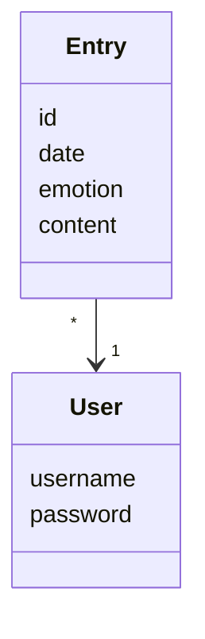
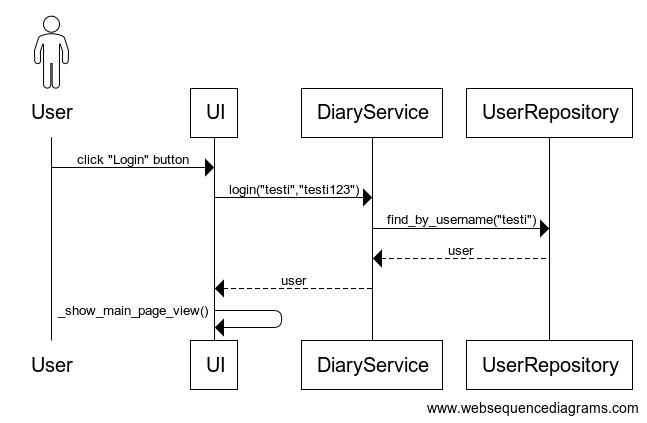

# Arkkitehtuurikuvaus

### Rakenne

- Käyttöliittymä: ui
- Sovelluslogiikka: services
- Tietojen tallennus: repositories
- Luokat tietojen tallennukseen: entities

```mermaid
 classDiagram
      Entry "*" --> "1" User
      class User{
          username
          password
      }
      class Entry{
          id
          date
          emotion
          content
      }
```

