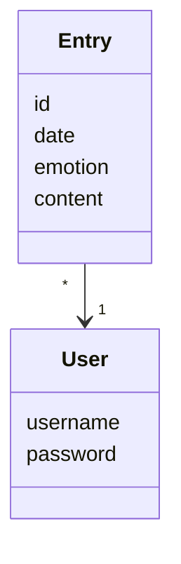

# Arkkitehtuurikuvaus

## Rakenne


- Käyttöliittymä: [ui](https://github.com/liisaket/ot-harjoitustyo/blob/master/src/ui)
- Sovelluslogiikka: [services](https://github.com/liisaket/ot-harjoitustyo/blob/master/src/services)
- Tietojen pysyväistallennus: [repositories](https://github.com/liisaket/ot-harjoitustyo/blob/master/src/repositories)
- Luokat datan käsittelyyn: [entities](https://github.com/liisaket/ot-harjoitustyo/blob/master/src/entities)

## Käyttöliittymä

Viisi näkymää:
- Kirjautuminen
- Uuden käyttäjän luominen
- Sovelluksen etusivu
- Uuden postauksen luominen
- Omat postaukset

Jokainen näkymä on oma luokkansa. Luokka [UI](https://github.com/liisaket/ot-harjoitustyo/blob/master/src/ui/ui.py) hoitaa näkymien näyttämisen.

## Sovelluslogiikka

Sovelluksen luokat datan käsittelyyn:

- [User](https://github.com/liisaket/ot-harjoitustyo/blob/master/src/entities/user.py): kuvaa yksittäistä käyttäjää (käyttäjätunnus ja salasana)
- [Entry](https://github.com/liisaket/ot-harjoitustyo/blob/master/src/entities/entry.py): kuvaa käyttäjän yksittäistä postausta (id, päivämäärä, tunnetila, lisätiedot)



Luokka, joka vastaa sovelluksen toiminnoista:

- [DiaryService](https://github.com/liisaket/ot-harjoitustyo/blob/master/src/services/diary_service.py)

Esimerkkejä DiaryService:n toiminnoista:

- ```login(username, password)```
- ```create_entry(content, emotion)```
- ```get_entries()```

DiaryService on yhteydessä luokkiin:

- [UserRepository](https://github.com/liisaket/ot-harjoitustyo/blob/master/src/repositories/user_repository.py): vastaa käyttäjiin liittyvistä tietokantaoperaatioista
- [EntryRepository](https://github.com/liisaket/ot-harjoitustyo/blob/master/src/repositories/entry_repository.py): vastaa postauksiin liittyvistä tietokantaoperaatioista


## Tietojen pysyväistallennus

Luokat, jotka vastaavat tietojen tallentamisesta:

- [UserRepository](https://github.com/liisaket/ot-harjoitustyo/blob/master/src/repositories/user_repository.py): vastaa käyttäjiin liittyvistä tietokantaoperaatioista (tallentaa SQLite-tietokantaan)
- [EntryRepository](https://github.com/liisaket/ot-harjoitustyo/blob/master/src/repositories/entry_repository.py): vastaa postauksiin liittyvistä tietokantaoperaatioista (tallentaa CSV-tiedostoon)

Konfiguraatiotiedosto [.env](https://github.com/liisaket/ot-harjoitustyo/blob/master/.env) määrittelee tiedostojen nimet datan tallennusta varten.

Käyttäjät tallennetaan SQLite-tietokantaan tauluun ```users``` arvoilla ```username``` ja ```password```. Taulu alustetaan [initialize_database.py](https://github.com/liisaket/ot-harjoitustyo/blob/master/src/initialize_database.py)-tiedostossa.

Sovellus tallentaa postauksien tiedot CSV-tiedostoon muodossa:

```
578e834c-127a-4eb1-9b18-079b170543b3;13-12-2022 16:00;Great day;happy;testi
```

1. Postauksen id
2. Postauksen päivämäärä (pv-kk-vvvv hh:mm)
3. Päivän lisätiedot/muistiinpanot
4. Päivän tunnetila
5. Postauksen omaava käyttäjä

## Päätoiminnallisuudet

...


