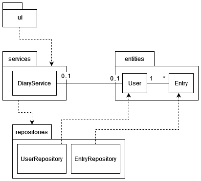

# Arkkitehtuurikuvaus

## Rakenne


- Käyttöliittymä: [ui](https://github.com/liisaket/ot-harjoitustyo/blob/master/src/ui)
- Sovelluslogiikka: [services](https://github.com/liisaket/ot-harjoitustyo/blob/master/src/services)
- Tietojen pysyväistallennus: [repositories](https://github.com/liisaket/ot-harjoitustyo/blob/master/src/repositories)
- Luokat datan käsittelyyn: [entities](https://github.com/liisaket/ot-harjoitustyo/blob/master/src/entities)

## Käyttöliittymä

Viisi näkymää:
- Kirjautuminen
- Uuden käyttäjän luominen
- Sovelluksen etusivu
- Uuden postauksen luominen
- Omat postaukset

Jokainen näkymä on oma luokkansa. Luokka [UI](https://github.com/liisaket/ot-harjoitustyo/blob/master/src/ui/ui.py) hoitaa näkymien näyttämisen.

## Sovelluslogiikka

Sovelluksen luokat datan käsittelyyn:

- [User](https://github.com/liisaket/ot-harjoitustyo/blob/master/src/entities/user.py): kuvaa yksittäistä käyttäjää (käyttäjätunnus ja salasana)
- [Entry](https://github.com/liisaket/ot-harjoitustyo/blob/master/src/entities/entry.py): kuvaa käyttäjän yksittäistä postausta (id, päivämäärä, tunnetila, lisätiedot)


Luokka, joka vastaa sovelluksen toiminnoista:

- [DiaryService](https://github.com/liisaket/ot-harjoitustyo/blob/master/src/services/diary_service.py)

Esimerkkejä DiaryService:n toiminnoista:

- ```login(username, password)```
- ```create_entry(content, emotion)```
- ```get_entries()```

DiaryService on yhteydessä luokkiin:

- [UserRepository](https://github.com/liisaket/ot-harjoitustyo/blob/master/src/repositories/user_repository.py): vastaa käyttäjiin liittyvistä tietokantaoperaatioista
- [EntryRepository](https://github.com/liisaket/ot-harjoitustyo/blob/master/src/repositories/entry_repository.py): vastaa postauksiin liittyvistä tietokantaoperaatioista

Pakkauskaavio ohjelmiston rakenteesta:



## Tietojen pysyväistallennus

Luokat, jotka vastaavat tietojen tallentamisesta:

- [UserRepository](https://github.com/liisaket/ot-harjoitustyo/blob/master/src/repositories/user_repository.py): vastaa käyttäjiin liittyvistä tietokantaoperaatioista (tallentaa SQLite-tietokantaan)
- [EntryRepository](https://github.com/liisaket/ot-harjoitustyo/blob/master/src/repositories/entry_repository.py): vastaa postauksiin liittyvistä tietokantaoperaatioista (tallentaa CSV-tiedostoon)

Konfiguraatiotiedosto [.env](https://github.com/liisaket/ot-harjoitustyo/blob/master/.env) määrittelee tiedostojen nimet datan tallennusta varten.

Käyttäjät tallennetaan SQLite-tietokantaan tauluun ```users``` arvoilla ```username``` ja ```password```. Taulu alustetaan [initialize_database.py](https://github.com/liisaket/ot-harjoitustyo/blob/master/src/initialize_database.py)-tiedostossa.

Sovellus tallentaa postauksien tiedot CSV-tiedostoon muodossa:

```
578e834c-127a-4eb1-9b18-079b170543b3;13-12-2022 16:00;Great day;happy;testi
```

1. Postauksen id
2. Postauksen päivämäärä ja kellonaika (pv-kk-vvvv hh:mm)
3. Päivän lisätiedot/muistiinpanot
4. Päivän tunnetila
5. Postauksen omaava käyttäjä

## Päätoiminnallisuudet ja toimintalogiikka

Seuraavaksi kuvaan sovelluksen toimintalogiikkaa kolmen esimerkin (sovelluksen päätoiminnallisuuksien) avulla.

### Sisäänkirjautuminen

Kun käyttäjä on syöttänyt kirjautumisnäkymässä käyttäjätunnuksensa ja salasanan, ja klikannut "Login"-nappia, tapahtuu seuraavaa:


- Napin painallukseen reagoi [tapahtumankäsittelijä](https://github.com/liisaket/ot-harjoitustyo/blob/master/src/ui/login_view.py#L20), joka kutsuu sovelluslogiikan ```DiaryService``` metodia [login](https://github.com/liisaket/ot-harjoitustyo/blob/master/src/services/diary_service.py#L46), jolle annetaan parametreiksi juuri syötetyt käyttäjätunnus ja salasana. 
- ```login```-metodi kutsuu käyttäjistä vastaavan luokan ```UserRepository``` funktiota [find_by_username](https://github.com/liisaket/ot-harjoitustyo/blob/master/src/repositories/user_repository.py#L46), jonka avulla tarkastetaan, onko käyttäjätunnus olemassa.
  - Jos käyttäjätunnus löytyy, funktio palauttaa kyseisen käyttäjän ```User```-oliona.
  - Muuten funktio palauttaisi None, johon sovelluslogiikan metodi reagoisi nostattamalla ```InvalidCredentialsError```-virhetilanteen.
- Kun käyttäjätunnus on löytynyt, sovelluslogiikan metodi vertaa syötettyä salasanaa ja käyttäjän tallennettua salasanaa; jos ne täsmäävät, kirjautuminen onnistuu.
- Sitten käyttöliittymä päivittää näkymäksi sovelluksen etusivun, eli ```Main Page```.

### Rekisteröityminen

Kun käyttäjä on syöttänyt pätevän (uniikin) käyttäjätunnuksen ja salasanan rekisteröitymisnäkymässä, ja klikannut "Create"-nappia, tapahtuu seuraavaa:


- [Tapahtumankäsittelijä](https://github.com/liisaket/ot-harjoitustyo/blob/master/src/ui/register_view.py#L20) reagoi napin painallukseen kutsumalla sovelluslogiikan metodia [register](https://github.com/liisaket/ot-harjoitustyo/blob/master/src/services/diary_service.py#L65), jolle annetaan parametreiksi juuri syötetyt käyttäjätunnus ja salasana.
- ```register```-metodi kutsuu ```UserRepository```-luokan funktiota ```find_by_username```, jonka avulla tarkastetaan, onko käyttäjätunnus jo olemassa.
  - Jos käyttäjätunnus olisi jo olemassa, sovelluslogiikan metodi reagoisi tähän nostattamalla ```UsernameExistsError```-virhetilanteen.
  - Jos käyttäjätunnusta ei löydy, metodi palauttaa None ja rekisteröityminen voi jatkua.
- Sovelluslogiikka luo uuden ```User```-olion ja kutsuu luokan ```UserRepository``` funktiota [create](https://github.com/liisaket/ot-harjoitustyo/blob/master/src/repositories/user_repository.py#L17) tallentamaan uuden käyttäjän ```users```-tietokantaan. Funktio palauttaa juuri tallennetun ```User```-olion.
- Luotu käyttäjä [sisäänkirjataan](https://github.com/liisaket/ot-harjoitustyo/blob/master/src/services/diary_service.py#L85) automaattisesti sovellukseen ja näkymä päivittyy sovelluksen etusivulle.

### Uuden postauksen luominen

Kun käyttäjä on siirtynyt uuden postauksen luomissivulle, valinnut päivän tunnetilan ja kirjoittanut lisätietoja päivästään, sekä klikannut "Save entry"-nappia tallentaakseen postauksen, tapahtuu seuraavaa:


- [Tapahtumankäsittelijä](https://github.com/liisaket/ot-harjoitustyo/blob/master/src/ui/new_entry_view.py#L73) reagoi napin painallukseen kutsumalla sovelluslogiikan metodia [create_entry](https://github.com/liisaket/ot-harjoitustyo/blob/master/src/services/diary_service.py#L107), jolle annetaan parametreiksi käyttäjän valitsema tunnetila (emotion), sekä hänen kirjoittamat lisätiedot päivästään (content).
- ```create_entry```-metodi luo uuden [Entry](https://github.com/liisaket/ot-harjoitustyo/blob/master/src/services/diary_service.py#L117)-olion postauksesta, jolle annetaan parametreiksi tunnetila, lisätiedot, sekä postauksen tehnyt käyttäjä.
- Tuo ```Entry```-olio annetaan postauksista vastaavan luokan ```EntryRepository``` funktiolle [create](https://github.com/liisaket/ot-harjoitustyo/blob/master/src/repositories/entry_repository.py#L46), joka tallentaa postauksen CSV-tiedostoon. Funktio palauttaa tallennetun ```Entry```-olion.
- Kun postaus on tallennettu, käyttöliittymä kutsuu omia metodeitaan ```_initialize_message("green")``` ja ```_show_message("Entry saved.")```. Näkymä päivittyy ja käyttäjä näkee vihreällä kirjoitetun ilmoituksen postauksen onnistuneesta tallentumisesta.

### Muut toiminnallisuudet

Muut toiminnallisuudet...

- Uloskirjautuminen
- ```Past entries```-sivu
- Postauksen poistaminen

...toimivat samalla periaatteella.
