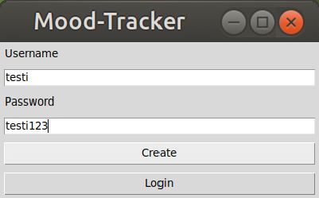

# Käyttöohje

- Lataa projektin viimeisimmän [releasen](https://github.com/liisaket/ot-harjoitustyo/releases) lähdekoodi (Releases -> Assets -> Source code)
- Avaa ladattu zip-kansio ja pura se
- Siirry purettuun kansioon terminaalissa

## Konfigurointi

Tallennukseen käytettävät tiedostot luodaan automaattisesti *data*-hakemistoon, mikäli niitä ei vielä ole siellä.

Halutessaan tiedostojen nimiä voi konfiguroida juurihakemistossa sijaitsevassa .env-tiedostossa, jossa tiedostot ovat muodossa:

```
ENTRIES_FILENAME=entries.csv
DATABASE_FILENAME=database.sqlite
```

## Sovelluksen käynnistäminen

1. Asenna riippuvuudet komennolla:

```bash
poetry install
```

2. Suorita alustustoimenpiteet komennolla:

```bash
poetry run invoke build
```

3. Käynnistä sovellus komennolla:

```bash
poetry run invoke start
```

## Kirjautuminen

Sisäänkirjautumissivu tulee näkyviin sovelluksen käynnistämisen yhteydessä.


Sisäänkirjaudutaan kirjoittamalla olemassaoleva käyttäjätunnus ja sen salasana syötekenttiin, ja painamalla "Login"-nappia. Jos sisäänkirjautuminen epäonnistuu, tulee esiin virheilmoitus epäpätevästä käyttäjätunnuksesta tai salasanasta.

## Uuden käyttäjän luominen

Sisäänkirjautumissivulta pääsee luomaan uuden käyttäjän painamalla "Create user"-nappia.



Uusi käyttäjä luodaan kirjoittamalla pätevä käyttäjätunnus ja salasana syötekenttiin ja painamalla "Create"-nappia. Jos käyttäjän luominen onnistuu, siirrytään sovelluksen etusivulle. Muussa tapauksessa tulee esiin virheilmoitus epäpätevästä käyttäjätunnuksesta.

Takaisin sisäänkirjautumissivulle pääsee painamalla "Login"-nappia.

## Etusivu

Kun sisään on kirjauduttu, tulee näkyviin sovelluksen etusivu.


Oma käyttäjätunnus näkyy vasemmassa yläkulmassa ("Logged in as *käyttäjätunnus*").

Oikean yläkulman "Logout"-napista voi kirjautua ulos, jolloin palataan takaisin kirjautumisnäkymään. "Logout"-nappi on saatavilla kaikissa näkymissä.

Uutta postausta pääsee luomaan "Make an entry"-napista.

Omia postauksia pääsee katsomaan "Past entries"-napista.

## Postauksen luominen

Kun etusivulla painetaan "Make an entry"-nappia, siirrytään uuden postauksen luomissivulle.


Valikosta valitaan päivän tunnetilaa kuvaava adjektiivi (happy, euphoric, calm, sad, angry, tired).

Syötekenttään kirjoitetaan lisätietoja omasta päivästä.

"Save an entry"-nappi tallentaa postauksen. Jos käyttäjä unohtaa valita tunnetilan tai kirjoittaa lisätietoja (tai molemmat), tulee virheilmoitus ja postausta ei tallenneta. Jos postauksen tallennus onnistuu, tästäkin tulee ilmoitus.

"Go back"-napista pääsee takaisin etusivulle.

## Vanhat postaukset

Kun etusivulla painetaan "Past entries"-nappia, siirrytään sivulle, jossa näkee käyttäjän omat postaukset.


Postauksen voi poistaa "Delete"-napista.

Jos käyttäjällä ei ole vielä postauksia, sivun otsikon alapuolella lukee "No entries (yet).".

"Go back"-napista pääsee takaisin etusivulle.

## Komentorivikomennot

### Testaus

Testit voi suorittaa komennolla:

```bash
poetry run invoke test
```

### Testikattavuusraportti

Testikattavuusraportin voi suorittaa komennolla:

```bash
poetry run invoke coverage-report
```

Raportti ilmestyy _htmlcov_-hakemistoon (tiedosto _index.hmtl_).

### Pylint

Pylint-tarkastukset voi suorittaa komennolla:

```bash
poetry run invoke lint
```
