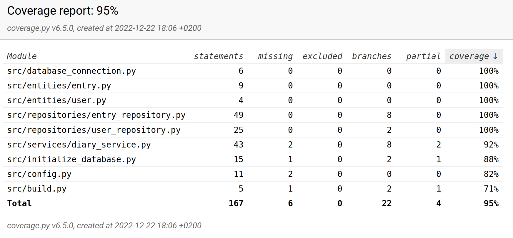

# Testausdokumentti

Sovellusta on testattu automaattisilla unittest-testeillä, sekä manuaalisesti.

## Unittest-testit

### Sovelluslogiikka

Sovelluslogiikan ```DiaryService```-luokkaa testataan [TestDiaryService](https://github.com/liisaket/ot-harjoitustyo/blob/master/src/tests/services/service_test.py)-testiluokalla. ```DiaryService```-olio alustetaan valerepositoreilla ```FakeUserRepository``` ja ```FakeEntryRepository```, jotka tallentavat dataa muistiin pysyväistallennuksen sijaan.

### Repositorio-luokat

Repositorio-luokat käsittelevät dataa, joten niiden testauksessa käytetään testeihin tarkoitettuja tiedostoja, joiden nimet ovat konfiguroitu juurihakemiston *.env.test*-tiedostoon. Luokkaa ```UserRepository``` testataan luokalla [TestUserRepository](https://github.com/liisaket/ot-harjoitustyo/blob/master/src/tests/repositories/user_repository_test.py#L6)-testiluokalla ja luokkaa ```EntryRepository``` testataan [TestEntryRepository](https://github.com/liisaket/ot-harjoitustyo/blob/master/src/tests/repositories/entry_repository_test.py#L7)-testiluokalla.

### ```User```- ja ```Entry```-oliot

```User```- ja ```Entry```-olioiden luominen ja käsittely tulee testattua ylläolevien ohessa.

## Testikattavuus



- Testikattavuus on 95%.
- Testauksessa ei otettu huomioon käyttöliittymäkerrosta.
- Testaamatta jäi ```DiaryService```-luokan osalta uloskirjautuminen ja kirjautumattoman käyttäjän postauksien hakeminen.
- *build.py*- ja *initialize_database.py*-tiedostojen osalta testaamatta jäi komentojen suorittaminen komentoriviltä.

## Manuaaliset testit

### Asennus ja konfigurointi

- Sovellusta on testattu [käyttöohjeen](https://github.com/liisaket/ot-harjoitustyo/blob/master/dokumentaatio/kayttoohje.md) mukaisesti Linux-ympäristössä.
- Testauksessa on myös kokeiltu eri konfiguraatioita *.env*-tiedoston kautta.
- Testattu olemassaolevilla tiedostoilla, sekä ei-olemassaolevilla tiedostoilla (sovellus on luonut ne).

### Toiminnallisuudet

- Kaikki sovelluksen toiminnallisuudet on käyty läpi.
- Myös mahdolliset virhetilanteet on käyty läpi (esim. tyhjä syöte).

## Sovellukseen jääneet laatuongelmat

Sovellus ei ota huomioon seuraavia tilanteita:

- Konfiguraatoituihin tiedostoihin ei ole luku- tai/ja kirjoitusoikeuksia.
- ```poetry run invoke build```-komento on jätetty suorittamatta, eli SQLite-tietokantaa ei ole alustettu
