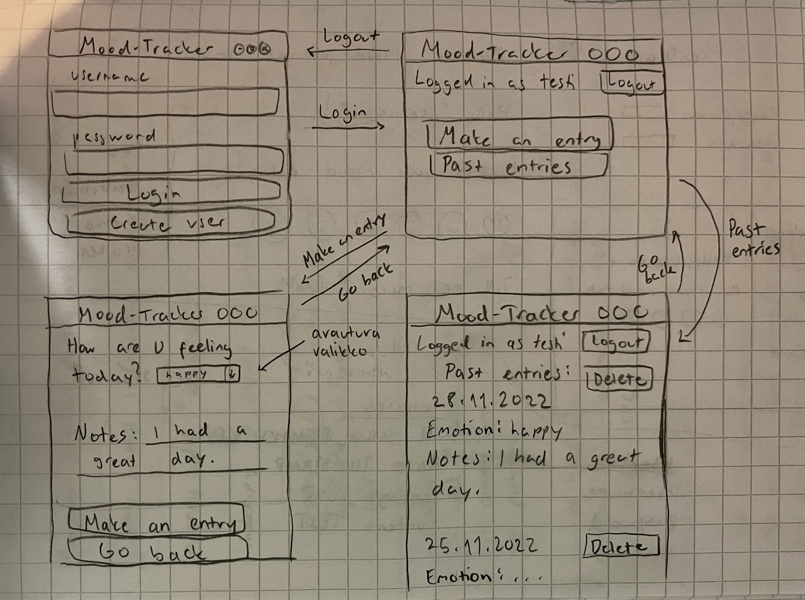

# Vaatimusmäärittely

## Sovelluksen tarkoitus

Mood-Tracker on päiväkirjasovellus omien tunteiden ja päivien seurantaan.

Sovelluksessa käyttäjä voi tehdä postauksen, jossa hän valitsee päivän tunnetilan ja kirjoittaa lisätietoja päivästään.

## Käyttöliittymäluonnos

- Sovellus koostuu viidestä eri näkymästä (kuvassa ei ole rekisteröitymisnäkymää, eikä vastaa siis täysin nykyistä versiota).
- Sovellus avautuu kirjautumisnäkymään, josta on mahdollista siirtyä rekisteröitymisnäkymään tai jos sisäänkirjautuminen onnistuu, sovelluksen etusivulle.

## Sovelluksen toiminnallisuudet

### Ennen kirjautumista

- Käyttäjä pystyy luomaan uuden käyttäjätunnuksen
  - Käyttäjätunnuksen tulee olla uniikki
  - Jos käyttäjän luominen ei onnistu, tulee esiin virheilmoitus
- Käyttäjä pystyy kirjautumaan sisään sovellukseen
  - Kirjautuminen onnistuu kirjautumissivulla, kirjoittamalla olemassaoleva käyttäjätunnus ja sen salasana syötekenttiin
  - Jos kirjautuminen epäonnistuu, tulee esiin virheilmoitus epäpätevästä käyttäjätunnuksesta tai salasanasta

### Kirjautumisen jälkeen

- Sovelluksella etusivulta pääsee uuden postauksen luomissivulle ja omien postauksien sivulle
- Käyttäjä pystyy luomaan uuden postauksen
  - Käyttäjä valitsee valikosta päivän tunnetilaa kuvaavan adjektiivin ja kirjoittaa lisätietoja omasta päivästä
  - Jos käyttäjä yrittää tallentaa postauksen, mutta on unohtanut valita tunnetilan tai kirjoittaa lisätietoja (tai molemmat), tulee esiin virheilmoitus ja postausta ei tallenneta
  - Onnistuneesta postauksen tallennuksesta tulee myös esiin ilmoitus
- Käyttäjä pystyy tutkia tekemiään postauksia
- Käyttäjä pystyy poistamaan omia postauksia
  - Tämä onnistuu painamalla postauksen vieressä olevaa "Delete"-nappia, jota klikkaamalla postaus poistuu heti ja näkymä päivittyy
- Käyttäjä pystyy kirjautumaan ulos "Logout"-napista jokaisella näkymällä

## Jatkokehitysideat

- Käyttäjä voi muokata merkintöjä
- Käyttäjä voisi nähdä tilastoja mielialoistaan
- Käyttäjätunnuksen ja sen tietojen poistaminen
